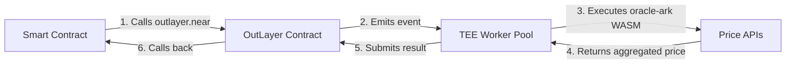

# TEE-Secured Price Oracle Proposal for NEAR Protocol
## Alternative Approach: On-Demand Oracle with Sustainable Economics

- **Submitted by:** FastNEAR Team
- **Date:** October 30, 2025
- **Project:** TEE-Secured Price Oracle (On-Demand Model via OutLayer Platform)
- **Grant Request:** $92,500 (first year) - **50% TEE hosting allocation + development on shared infrastructure**

---

## Executive Summary

**TL;DR:** Instead of funding a dedicated oracle network ($24K/month for idle nodes), we propose funding **OutLayer platform** ($2.75K/month for shared infrastructure) that serves oracle + AI + computation. New oracle with zero clients → on-demand is logical. When profitable, operators add push workers funded by user fees (no perpetual grants). **89% lower cost, sustainable growth path.**

---

We propose an **alternative approach** to the RFP: instead of funding a dedicated oracle network with 5+ nodes that only push prices, we propose to **enhance the existing OutLayer platform** (live on mainnet at `outlayer.near`) to provide **TEE-secured, on-demand price feeds** as one of its workloads.

**Key Innovation:** Rather than deploying dedicated oracle-only infrastructure that sits idle 95%+ of the time, we extend NEAR's existing **general-purpose off-chain computation platform** ([OutLayer](https://github.com/fastnear/near-outlayer)) with a specialized oracle WASM module ([`oracle-ark`](https://github.com/zavodil/oracle-ark)) that **already works in production** (see [mainnet transaction](https://nearblocks.io/txns/81EqJwxpbAdcArmjaJnaWU8VED3t8DemZ4ezr2TSPw5p)).

**Why This Approach?**
- 💰 **Shared infrastructure**: OutLayer nodes serve oracle + AI inference + arbitrary computation (oracle gets priority)
- 🎯 **For a new oracle with zero clients**: On-demand payment is far more logical than continuous push model
- 📈 **Future growth path**: As demand grows, operators can add dedicated push workers funded by user fees (no perpetual grants)
- ✅ **Better ecosystem value**: One grant supports multiple use cases, not just oracle

**Benefits vs. Dedicated Oracle:**
- ✅ **89% lower grant dependency** ($2,750/month vs. $24,153/month for dedicated oracle)
- ✅ **Shared infrastructure efficiency**: Same nodes serve oracle, AI inference, computation (not idle 95% of time)
- ✅ **Logical for bootstrapping**: New oracle with zero clients → on-demand makes sense, avoid wasted gas
- ✅ **Self-sustaining growth**: As usage grows, operators earn fees and can add push workers (no perpetual grants)
- ✅ **Battle-tested foundation**: OutLayer contract deployed and operational on mainnet
- ✅ **Immediate availability**: oracle-ark WASM module functional today (proven in production)
- ✅ **TEE-native design**: Phala/Dstack integration planned from day one
- ✅ **Flexible architecture**: Supports **any asset** with public APIs - crypto, stocks (AAPL, TSLA), commodities (gold, oil), forex (EUR/USD), even game prices (Steam, Epic Games) - unlimited coverage
- ✅ **Optional caching layer**: For protocols needing instant prices (90%+ cache hit rate)

---

## Table of Contents

1. [How It Works](#how-it-works)
2. [Architecture](#architecture)
3. [Team](#team)
4. [Technical Implementation](#technical-implementation)
5. [RFP Requirements Compliance](#rfp-requirements-compliance)
6. [Budget & Timeline](#budget--timeline)
7. [Advantages Over Traditional Oracles](#advantages-over-traditional-oracles)
8. [Deliverables](#deliverables)
9. [Contact](#contact)

---

## How It Works

### On-Demand Oracle Model

**Context:** This proposal offers an **alternative to the RFP's push-based model**. While the RFP specifies 5+ nodes continuously pushing prices, we propose leveraging OutLayer's general-purpose infrastructure where oracle is one of many workloads.

**Why on-demand for a new oracle?**
- 🆕 **Zero existing clients**: Unlike Chainlink/Pyth (millions of queries/day), this oracle starts from zero
- 💸 **Avoid waste**: Pushing prices every minute with zero queries = 100% wasted gas ($18,403/month thrown away)
- 📈 **Grow sustainably**: Users pay per query → operators earn fees → can fund dedicated push workers later
- 🔄 **Caching option available**: Protocols can deploy cache contracts for instant access (see Section 2.5)

Unlike traditional oracles where dedicated nodes continuously push prices (even when nobody needs them), our oracle operates **on-demand** via shared OutLayer infrastructure:



**Example: DeFi protocol needs BTC/USD price**

**Option A: Direct call from DeFi contract (full control):**

```bash
# Protocol calls outlayer.near with full configuration:
near call outlayer.near request_execution '{
  "code_source": {
    "repo": "https://github.com/zavodil/oracle-ark",
    "commit": "main",
    "build_target": "wasm32-wasip2"
  },
  "input_data": {
    "requests": [{
      "id": "btc_price",
      "sources": [
        {"name": "coingecko", "id": "bitcoin"},
        {"name": "binance", "id": "BTCUSDT"},
        {"name": "kucoin", "id": "BTC-USDT"},
        {"name": "pyth", "id": "0xe62df6c8b4a85fe1a67db44dc12de5db330f7ac66b72dc658afedf0f4a415b43"}
      ],
      "aggregation_method": "median",
      "min_sources_num": 3
    }],
    "max_price_deviation_percent": 5.0
  },
  "resource_limits": {
    "max_instructions": 10000000000,
    "max_memory_mb": 128,
    "max_execution_seconds": 60
  }
}' --accountId defi.near --deposit 0.004
```

**Option B: Wrapper contract (simple, recommended for most protocols):**

```rust
// Deploy once: oracle-wrapper.near
near call oracle-wrapper.near get_price '{"asset": "BTC"}' --accountId defi.near --deposit 0.004
```

**Wrapper contract implementation (provided by us):**
```rust
#[near_bindgen]
pub struct OracleWrapper {
    // Pre-configured sources per asset
    configs: LookupMap<String, AssetConfig>,
}

impl OracleWrapper {
    /// Simple interface: just specify asset symbol
    pub fn get_price(&self, asset: String) -> Promise {
        let config = self.configs.get(&asset).expect("Asset not supported");

        // Build request with pre-configured sources
        let request = json!({
            "code_source": {
                "repo": "https://github.com/zavodil/oracle-ark",
                "commit": "stable-v1.0",  // Fixed version for security
                "build_target": "wasm32-wasip2"
            },
            "input_data": {
                "requests": [{
                    "id": format!("{}_price", asset.to_lowercase()),
                    "sources": config.sources,  // Pre-configured (CoinGecko, Binance, etc.)
                    "aggregation_method": "median",
                    "min_sources_num": 5
                }],
                "max_price_deviation_percent": 3.0
            },
            "resource_limits": {
                "max_instructions": 10_000_000_000,
                "max_memory_mb": 128,
                "max_execution_seconds": 60
            }
        });

        // Forward to outlayer.near
        ext_outlayer::request_execution(
            request.code_source,
            serde_json::to_string(&request.input_data).unwrap(),
            request.resource_limits,
            None,
            AccountId::new_unchecked("outlayer.near".to_string()),
            NearToken::from_millinear(4), // 0.004 NEAR (actual mainnet cost)
            Gas::from_tgas(100),
        )
        .then(Self::ext(env::current_account_id()).on_price_callback())
    }

    #[private]
    pub fn on_price_callback(&self) -> PriceData {
        // Parse and return result
        // ...
    }
}
```

**Benefits of wrapper:**
- ✅ **Simple API**: `get_price("BTC")` instead of complex JSON
- ✅ **Pre-configured sources**: No need to know GitHub URLs, API names, etc.
- ✅ **Version stability**: Uses fixed `stable-v1.0` branch, not `main`
- ✅ **Governance**: Wrapper owner can update sources/configs via DAO
- ✅ **Backwards compatible**: Protocols don't break when oracle-ark updates

```json
// 2. TEE worker executes oracle-ark WASM in Phala enclave
// 3. Fetches from 4+ sources (CoinGecko, Binance, KuCoin, Pyth)
// 4. Validates deviation ≤5%, aggregates via median
// 5. Returns result with TEE attestation:

{
  "results": [{
    "id": "btc_price",
    "data": {
      "value": 98234.50,
      "timestamp": 1761827558,
      "sources": ["coingecko", "binance", "kucoin", "pyth"]
    },
    "message": "coingecko: 98240.00, binance: 98230.00, kucoin: 98233.50, pyth: 98235.00, median: 98234.50"
  }]
}
```

**Cost:** ~0.004 NEAR per query (~$0.01 USD at current prices, based on actual mainnet tx)
**Latency:** 3-5 seconds (after initial WASM compilation)
**Security:** TEE attestation proves correct execution

---

## Architecture

### System Components

```
┌────────────────────────────────────────────────────────────────┐
│                        NEAR Blockchain                         │
│  ┌──────────────────────────────────────────────────────────┐  │
│  │  outlayer.near (Smart Contract)                          │  │
│  │  - Yield/resume mechanism                                │  │
│  │  - Payment processing                                    │  │
│  │  - TEE attestation verification                          │  │
│  │  - Resource limit enforcement                            │  │
│  └─────────┬────────────────────────────────────────────────┘  │
│            │ Emits ExecutionRequested event                    │
└────────────┼───────────────────────────────────────────────────┘
             │
             ▼
┌───────────────────────────────────────────────────────────────┐
│                  TEE Worker Pool (Phala/Dstack)               │
│  ┌──────────────────┐  ┌──────────────────┐  ┌─────────────┐  │
│  │   Worker Node 1  │  │   Worker Node 2  │  │  Worker N   │  │
│  │   (TEE-enabled)  │  │   (TEE-enabled)  │  │(TEE-enabled)│  │
│  │                  │  │                  │  │             │  │
│  │ ┌──────────────┐ │  │ ┌──────────────┐ │  │             │  │
│  │ │ Phala Enclave│ │  │ │ Phala Enclave│ │  │             │  │
│  │ │              │ │  │ │              │ │  │             │  │
│  │ │ oracle-ark   │ │  │ │ oracle-ark   │ │  │             │  │
│  │ │ WASM module  │ │  │ │ WASM module  │ │  │             │  │
│  │ │              │ │  │ │              │ │  │             │  │
│  │ │ - Fetch APIs │ │  │ │ - Fetch APIs │ │  │             │  │
│  │ │ - Aggregate  │ │  │ │ - Aggregate  │ │  │             │  │
│  │ │ - Validate   │ │  │ │ - Validate   │ │  │             │  │
│  │ └──────────────┘ │  │ └──────────────┘ │  │             │  │
│  └──────────────────┘  └──────────────────┘  └─────────────┘  │
└─────────────┬─────────────────────────────────────────────────┘
              │
              ▼
┌─────────────────────────────────────────────────────────────────┐
│                      External Price APIs                        │
│  CoinGecko | Binance | Huobi | Crypto.com | KuCoin | Gate.io    │
│  Pyth | ExchangeRate-API | TwelveData | Custom APIs             │
└─────────────────────────────────────────────────────────────────┘
```

### Key Advantages of This Architecture

1. **Shared Infrastructure Efficiency**: Same workers serve oracle + AI inference + arbitrary computation (oracle gets priority queue)
2. **No Dedicated Idle Costs**: Unlike dedicated oracle nodes (idle 95%+ of time), OutLayer nodes always productive
3. **Horizontal Scalability**: Add workers during high load, remove during low load
4. **TEE Security**: Every execution produces cryptographic attestation
5. **Flexible Data Sources**: Support any asset with ≥5 APIs (not limited to crypto)
6. **User-Pays Model**: Protocols pay directly for queries they need, operators earn fees
7. **Sustainable Growth**: When profitable, operators add push workers funded by user fees (no perpetual grants)
8. **Censorship Resistance**: Multiple independent worker operators

---

## Team

### FastNEAR - Industry Veterans in Blockchain Infrastructure

**Eugene** - Co-founder & Lead Architect
- Co-founder of FastNEAR and founder of NEAR.social
- Previously: Proximity Labs, NEAR Protocol, Google, Facebook
- Extensive experience in blockchain architecture and developer tooling

**Mike** - Infrastructure & Security Lead
- Early NEAR ecosystem contributor with extensive blockchain infrastructure experience
- Former web3 startup founder with VC backing
- Expert in server management and validator operations, specializing in high-stakes migrations and security implementations

**Vadim** - Blockchain Developer & Performance Engineer
- Seasoned blockchain developer and infrastructure specialist
- Skilled in building scalable, secure systems and optimizing performance for high-demand applications
- Committed to privacy and security best practices in all projects

**Track Record:**
- ✅ **Previous NEAR Native Price Oracle** - FastNEAR team built the original NEAR native price oracle (later replaced by Pyth)
  - Deep understanding of oracle economics and DeFi protocol needs
  - Learned from operational challenges: continuous push models are expensive and wasteful for low-volume use
- ✅ **OutLayer Platform** ([GitHub](https://github.com/fastnear/near-outlayer)) - Born from the idea of making TEE oracles economically viable
  - Originally conceived as infrastructure for cost-efficient TEE-secured price feeds
  - Evolved into general-purpose off-chain computation platform (AI inference, arbitrary computation, oracles)
  - Now live on mainnet (`outlayer.near`) serving multiple use cases
  - Full source code: contract, coordinator, workers, examples
- ✅ **NEAR.social** - Decentralized social platform (Eugene founder)
- ✅ **FastNEAR** - High-performance NEAR infrastructure services (validators, indexers, APIs)
- ✅ **oracle-ark** - Working price oracle WASM module ([GitHub](https://github.com/zavodil/oracle-ark), [mainnet tx](https://nearblocks.io/txns/81EqJwxpbAdcArmjaJnaWU8VED3t8DemZ4ezr2TSPw5p))

**Why We're Uniquely Qualified:**
- 📊 **Built the previous native oracle**: We understand what works and what doesn't
- 💡 **Created OutLayer specifically for this use case**: TEE oracles were the original inspiration
- 🏗️ **Battle-tested infrastructure**: OutLayer proven in production, ready for TEE integration
- 🎯 **Deep ecosystem knowledge**: Years of operating NEAR infrastructure and building developer tools

---

## Technical Implementation

### 1. Oracle WASM Module (oracle-ark)

**Status:** ✅ Already working in production

The core oracle logic exists as a WASM module that:

- Fetches prices from **10+ sources**: CoinGecko, Binance, Huobi, Crypto.com, KuCoin, Gate.io, Pyth, ExchangeRate-API, TwelveData, custom APIs
- Supports **3 aggregation methods**: Average, Median, Weighted Average
- Validates **price deviation** (configurable threshold)
- Returns **detailed results** with per-source breakdown
- Handles **batch requests** (up to 10 assets per call)
- Supports **encrypted API keys** via WASI environment variables

**Code:** https://github.com/zavodil/oracle-ark
**Live Example:** https://nearblocks.io/txns/81EqJwxpbAdcArmjaJnaWU8VED3t8DemZ4ezr2TSPw5p

#### Request Format

```typescript
interface OracleRequest {
  requests: DataRequest[];
  max_price_deviation_percent: number;
}

interface DataRequest {
  id: string;                          // "btc_price", "eth_price", etc.
  sources: PriceSource[];              // List of APIs to query
  aggregation_method: "average" | "median" | "weighted_avg";
  min_sources_num: number;             // Minimum successful sources (e.g., 5)
}

interface PriceSource {
  name: string;                        // "coingecko", "binance", "pyth", etc.
  id?: string;                         // Source-specific ID (optional)
  custom?: CustomSourceConfig;         // For custom APIs
}
```

#### Response Format

```typescript
interface OracleResponse {
  results: DataResponse[];
}

interface DataResponse {
  id: string;
  data?: {
    value: number;                     // Aggregated price
    timestamp: number;                 // Unix timestamp
    sources: string[];                 // Successful sources
  };
  message?: string;                    // Errors or detailed info
}
```

**Example Response:**
```json
{
  "results": [{
    "id": "near_price",
    "data": {
      "value": 2.178667,
      "timestamp": 1761827558,
      "sources": ["coingecko", "binance", "huobi", "cryptocom", "kucoin", "gate", "pyth"]
    },
    "message": "coingecko: 2.180000, binance: 2.179000, huobi: 2.179250, cryptocom: 2.175333, kucoin: 2.178367, gate: 2.178667, pyth: 2.178503, median: 2.178667"
  }]
}
```

### 2. OutLayer Smart Contract

**Status:** ✅ Deployed on mainnet as `outlayer.near`

The OutLayer contract provides:

- **Yield/Resume Mechanism**: Pauses contract execution while waiting for off-chain computation
- **Payment Processing**: Escrows payment, calculates cost based on resources used, refunds excess
- **Event Emission**: Broadcasts `ExecutionRequested` events for workers to pick up
- **Result Verification**: Validates TEE attestation before accepting results
- **Timeout Handling**: Allows cancellation of stale requests (10 min timeout)
- **Secrets Management**: Stores encrypted API keys for oracle workers
- **Immutable WASM Storage**: Can store oracle-ark WASM directly on-chain for faster execution (no GitHub fetch)

**Contract API:**
```rust
// Request price from oracle
pub fn request_execution(
    code_source: CodeSource,           // GitHub repo OR immutable on-chain WASM
    input_data: String,                // JSON with price requests
    resource_limits: ResourceLimits,   // CPU, memory, time limits
    secrets_ref: Option<SecretsReference>, // Encrypted API keys
) -> Promise;

// Worker submits result (called by TEE node)
pub fn resolve_execution(
    request_id: u64,
    response: ExecutionResponse,       // Includes TEE attestation
);

// Store immutable WASM on-chain (one-time setup)
pub fn store_immutable_wasm(
    wasm_hash: String,                 // SHA256 of WASM binary
    wasm_bytes: Vec<u8>,               // Compiled WASM binary
) -> StorageDeposit;
```

**WASM Storage Options:**

**Option A: GitHub (flexible, slower first execution)**
```rust
CodeSource {
    repo: "https://github.com/zavodil/oracle-ark",
    commit: "stable-v1.0",
    build_target: "wasm32-wasip2"
}
// Worker compiles on first request (~2-3 min), then caches
```

**Option B: On-Chain Immutable (fastest, most secure)**
```rust
CodeSource {
    immutable_hash: "sha256:abc123...",  // Reference to on-chain WASM
    build_target: None                    // Pre-compiled
}
// Worker loads directly from contract storage (~1 second)
// No GitHub dependency, no compilation, verifiable hash
```

**Benefits of On-Chain Storage:**
- ⚡ **Instant execution**: No GitHub fetch, no compilation (1 sec vs 2-3 min first time)
- 🔒 **Immutable & verifiable**: WASM hash on-chain, can't be changed without DAO approval
- 🚫 **No external dependencies**: Works even if GitHub is down
- ✅ **TEE-friendly**: Workers can verify hash matches expected code
- 💾 **Storage cost**: ~200 KB WASM × 0.0001 NEAR/byte ≈ 0.02 NEAR one-time deposit

### 2.5. Caching Oracle Contract (Optional Enhancement)

**Status:** 🔨 Can be provided as example implementation

For protocols that need **instant price access** without waiting for off-chain execution, we can provide a **caching oracle contract** that sits between the protocol and OutLayer:

```
Protocol → cache-oracle.near → (if stale) → outlayer.near → TEE Workers
         ↓ (if fresh)
         └─ Returns cached price instantly
```

#### Caching Contract Architecture

```rust
#[near_bindgen]
pub struct CachedOracle {
    // Price cache with freshness tracking
    prices: LookupMap<AssetId, CachedPrice>,

    // Configuration per asset
    configs: LookupMap<AssetId, OracleConfig>,

    // Pending requests (while fetching fresh price)
    pending: LookupMap<AssetId, Vec<PendingCallback>>,
}

pub struct CachedPrice {
    pub value: f64,
    pub timestamp: u64,
    pub sources: Vec<String>,
    pub attestation: Option<Vec<u8>>,  // TEE proof
}

pub struct OracleConfig {
    // How long cached price is valid
    pub max_age_seconds: u64,           // e.g., 60 (1 minute) for typical use

    // OutLayer request parameters
    pub sources: Vec<PriceSource>,      // Which APIs to query
    pub aggregation: AggregationMethod,
    pub min_sources: usize,
    pub max_deviation: f64,

    // Who can update config
    pub owner: AccountId,
}

#[near_bindgen]
impl CachedOracle {
    /// Get price (instant if cached, async if stale)
    pub fn get_price(&mut self, asset_id: String) -> PromiseOrValue<PriceData> {
        let cached = self.prices.get(&asset_id);
        let config = self.configs.get(&asset_id)
            .expect("Asset not configured");

        let now = env::block_timestamp() / 1_000_000_000;

        // Check if cached price is fresh enough
        if let Some(price) = cached {
            if now - price.timestamp < config.max_age_seconds {
                // ✅ Fresh cache hit - return immediately
                return PromiseOrValue::Value(PriceData {
                    value: price.value,
                    timestamp: price.timestamp,
                    sources: price.sources.clone(),
                });
            }
        }

        // ❌ Cache miss or stale - fetch fresh price
        self.fetch_fresh_price(asset_id, config)
    }

    /// Fetch fresh price from OutLayer (async)
    fn fetch_fresh_price(
        &mut self,
        asset_id: String,
        config: OracleConfig
    ) -> PromiseOrValue<PriceData> {
        // Build oracle request
        let oracle_request = json!({
            "requests": [{
                "id": &asset_id,
                "sources": config.sources,
                "aggregation_method": config.aggregation,
                "min_sources_num": config.min_sources,
            }],
            "max_price_deviation_percent": config.max_deviation,
        });

        // Call OutLayer with immutable WASM (faster, no GitHub dependency)
        ext_outlayer::request_execution(
            CodeSource {
                immutable_hash: "sha256:oracle-ark-v1.0".to_string(), // Pre-stored on-chain
                build_target: None,  // Pre-compiled
            },
            serde_json::to_string(&oracle_request).unwrap(),
            ResourceLimits {
                max_instructions: 10_000_000_000,
                max_memory_mb: 128,
                max_execution_seconds: 60,
            },
            Some(SecretsReference {
                profile: "production".to_string(),
                account_id: env::current_account_id(),
            }),
            AccountId::new_unchecked("outlayer.near".to_string()),
            NearToken::from_millinear(4), // 0.004 NEAR (actual mainnet cost)
            Gas::from_tgas(100),
        )
        .then(
            Self::ext(env::current_account_id())
                .on_price_fetched(asset_id)
        )
        .into()
    }

    /// Callback: cache fresh price and return to caller
    #[private]
    pub fn on_price_fetched(&mut self, asset_id: String) -> PriceData {
        // Parse OutLayer response
        let result: OracleResponse = near_sdk::serde_json::from_slice(
            &env::promise_result(0).unwrap()
        ).unwrap();

        let price_data = result.results[0]
            .data.as_ref()
            .expect("Price fetch failed");

        // Update cache
        self.prices.insert(
            &asset_id,
            &CachedPrice {
                value: price_data.value,
                timestamp: price_data.timestamp,
                sources: price_data.sources.clone(),
                attestation: None, // TODO: extract from OutLayer response
            },
        );

        // Return fresh price
        PriceData {
            value: price_data.value,
            timestamp: price_data.timestamp,
            sources: price_data.sources.clone(),
        }
    }

    /// Admin: configure asset
    pub fn set_config(&mut self, asset_id: String, config: OracleConfig) {
        // Only contract owner or asset owner can configure
        assert!(
            env::predecessor_account_id() == self.owner
            || env::predecessor_account_id() == config.owner,
            "Unauthorized"
        );

        self.configs.insert(&asset_id, &config);
    }
}
```

#### Usage Example: DeFi Protocol

```rust
// Before (direct OutLayer call - 3-5 seconds latency):
let price = outlayer.request_execution(...).await; // ⏰ Wait for TEE execution

// After (with caching - instant if fresh):
let price = cache_oracle.get_price("btc_price").await; // ⚡ Instant if cached
```

#### Cache Performance

| Scenario | Cache Status | Latency | Cost |
|----------|--------------|---------|------|
| **Frequent queries** | Cache hit (90%+) | <100ms | ~0.0001 NEAR (contract call only) |
| **First query** | Cache miss | 3-5 seconds | 0.004 NEAR (OutLayer execution) |
| **Stale price** | Cache expired | 3-5 seconds | 0.004 NEAR (refresh) |

#### Configuration Flexibility

Each protocol can configure cache freshness per asset:

```typescript
// Standard use: 1-minute cache (recommended)
await cacheOracle.set_config("btc_price", {
  max_age_seconds: 60,  // 1 minute - good balance of freshness and efficiency
  sources: [...10+ sources],
  aggregation: "median",
  min_sources: 5,
  max_deviation: 2.0,
});

// High-frequency trading: 30-second cache
await cacheOracle.set_config("eth_price", {
  max_age_seconds: 30,  // More frequent updates for critical operations
  sources: [...],
  aggregation: "median",
  min_sources: 5,
  max_deviation: 1.0,
});

// Low-priority assets: 5-minute cache
await cacheOracle.set_config("obscure_token", {
  max_age_seconds: 300,
  sources: [...],
  aggregation: "average",
  min_sources: 2,
  max_deviation: 10.0,
});
```

#### Benefits of Caching Layer

1. **Instant Responses**: 90%+ queries return immediately (cache hits)
2. **Cost Reduction**: Protocols share cache, reducing OutLayer calls
3. **UX Improvement**: No waiting for TEE execution on every call
4. **Configurable Freshness**: Each asset/protocol decides staleness tolerance
5. **Backwards Compatible**: Drop-in replacement for direct OutLayer calls

#### Implementation Commitment

We commit to providing:
- ✅ **Reference implementation** (example caching contract)
- ✅ **Deployment scripts** (deploy your own cache instance)
- ✅ **Configuration guide** (how to set up asset configs)
- ✅ **Best practices** (when to cache vs. direct OutLayer)

**Note:** Caching is **optional** - protocols can call OutLayer directly if they need guaranteed-fresh prices for every transaction.

### 3. TEE Worker Pool (Phala/Dstack)

**Status:** 🔨 To be implemented (current workers run without TEE)

We will deploy **5+ independent worker nodes** running in Phala Network enclaves:

#### Worker Architecture

```rust
// Worker runs inside Phala TEE enclave
pub struct OracleWorker {
    // Generated inside TEE, never leaves enclave
    private_key: Ed25519PrivateKey,

    // Monitors NEAR blockchain for ExecutionRequested events
    event_monitor: EventMonitor,

    // Executes oracle-ark WASM in isolated environment
    wasm_executor: WasmiExecutor,

    // Submits results back to outlayer.near
    result_submitter: NearClient,
}

impl OracleWorker {
    // Main loop
    pub async fn run(&mut self) {
        loop {
            // 1. Poll for new execution requests
            let request = self.event_monitor.poll_next().await;

            // 2. Fetch encrypted API keys from contract
            let secrets = self.fetch_secrets(&request).await;

            // 3. Decrypt secrets inside TEE
            let api_keys = self.decrypt_in_enclave(&secrets);

            // 4. Execute oracle-ark WASM with API keys
            let result = self.wasm_executor.execute(
                &request.input_data,
                api_keys,
            ).await;

            // 5. Generate TEE attestation
            let attestation = self.generate_attestation(&result);

            // 6. Submit result + attestation to contract
            self.result_submitter.resolve_execution(
                request.request_id,
                result,
                attestation,
            ).await;
        }
    }
}
```

#### TEE Security Properties

- ✅ **Code Attestation**: Phala enclave provides cryptographic proof of exact code running
- ✅ **Secret Isolation**: API keys decrypted only inside enclave, never exposed to operator
- ✅ **Result Integrity**: Attestation proves output came from unmodified oracle-ark WASM
- ✅ **Operator Independence**: 5+ independent operators (diversified geographically and organizationally)

### 4. API Key Management

**Encrypted Secrets Storage:**

```typescript
// 1. User encrypts API keys client-side with keystore public key
const encryptedSecrets = await encrypt({
  "COINGECKO_API_KEY": "cg-...",
  "COINMARKETCAP_API_KEY": "cmck-...",
  "TWELVEDATA_API_KEY": "td-...",
  // Custom API keys for proprietary data sources
  "CUSTOM_API_KEY": "..."
}, keystorePublicKey);

// 2. Store on-chain (one-time setup)
await outlayer.store_secrets({
  repo: "github.com/zavodil/oracle-ark",
  branch: "main",
  profile: "production",
  encrypted_secrets_base64: encryptedSecrets,
  access: "AllowAll", // Or whitelist specific accounts
});
```

**Usage in Execution:**

```typescript
// Reference secrets when requesting execution
await outlayer.request_execution({
  code_source: {...},
  input_data: {...},
  secrets_ref: {
    profile: "production",
    account_id: "defi.near",  // Owner of the secrets
  },
});
```

Workers automatically:
1. Fetch encrypted secrets from contract
2. Decrypt inside TEE enclave
3. Inject as environment variables into WASM execution
4. Clear from memory after execution

### 5. Supported Assets

**Current Support (10+ price sources):**

| Category | Sources | Example Assets |
|----------|---------|----------------|
| **Cryptocurrencies** | CoinGecko, Binance, Huobi, Crypto.com, KuCoin, Gate.io, Pyth | BTC, ETH, NEAR, SOL, AVAX, BNB, ... |
| **Stocks** | Alpha Vantage, Yahoo Finance, TwelveData | AAPL, TSLA, GOOGL, NVDA, ... |
| **Forex** | ExchangeRate-API, Fixer.io | EUR/USD, GBP/JPY, ... |
| **Commodities** | TwelveData, Metals-API | Gold (XAU/USD), Oil (BRENT/USD), Silver (XAG/USD), ... |
| **Game Prices** | Steam API, Epic Games, Humble Bundle | Steam game prices, DLC prices, regional pricing |
| **Custom APIs** | User-defined | Any data source with JSON API |

**Why This Matters:**
- 🎮 **Gaming NFTs**: Price game items from Steam/Epic in NEAR tokens for in-game marketplaces
- 📈 **Synthetic Assets**: Create on-chain derivatives for real-world stocks (AAPL/ETH, TSLA/NEAR)
- 🏅 **Commodity-Backed Tokens**: Gold/silver-backed stablecoins with verifiable pricing
- 💱 **Cross-Chain Forex**: Enable forex trading pairs on NEAR DeFi protocols

**Easy to Add New Assets:**

Adding support for new assets requires **zero code changes** - just specify different sources in the request:

**Example 1: Apple Stock Price (AAPL)**
```json
{
  "requests": [{
    "id": "aapl_stock",
    "sources": [
      {"name": "alphavantage", "id": "AAPL"},
      {"name": "yahoofinance", "id": "AAPL"},
      {"name": "twelvedata", "id": "AAPL"},
      {"name": "custom", "custom": {
        "url": "https://api.example.com/stock/AAPL",
        "json_path": "price",
        "value_type": "number"
      }}
    ],
    "aggregation_method": "median",
    "min_sources_num": 3
  }]
}
```

**Example 2: Steam Game Price (Cyberpunk 2077)**
```json
{
  "requests": [{
    "id": "cyberpunk_usd",
    "sources": [
      {"name": "custom", "custom": {
        "url": "https://store.steampowered.com/api/appdetails?appids=1091500",
        "json_path": "data.1091500.price_overview.final",
        "value_type": "number",
        "transform": "divide_by_100"
      }},
      {"name": "custom", "custom": {
        "url": "https://api.isthereanydeal.com/v1/game/price?key=XXX&id=1091500",
        "json_path": "price.current",
        "value_type": "number"
      }},
      {"name": "custom", "custom": {
        "url": "https://api.cheapshark.com/stores",
        "json_path": "stores[0].price",
        "value_type": "number"
      }}
    ],
    "aggregation_method": "median",
    "min_sources_num": 2
  }]
}
```

**Example 3: Gold Price (XAU/USD)**
```json
{
  "requests": [{
    "id": "gold_usd",
    "sources": [
      {"name": "twelvedata", "id": "XAU/USD"},
      {"name": "metals-api", "id": "GOLD"},
      {"name": "custom", "custom": {
        "url": "https://api.gold-api.com/price/XAU",
        "json_path": "price",
        "value_type": "number"
      }}
    ],
    "aggregation_method": "median",
    "min_sources_num": 3
  }]
}
```

**RFP Requirement Compliance:**
- ✅ Top 30 assets by market cap
- ✅ Top 10 NEAR tokens by market cap
- ✅ Committee-requested assets (via custom sources)
- ✅ Minimum 5 price APIs per asset (enforced via `min_sources_num`)

---

## RFP Requirements Compliance

### Overall Requirements

| Requirement | Status | Implementation |
|-------------|--------|----------------|
| **Open-source code with documentation** | ✅ Ready | [OutLayer Platform](https://github.com/fastnear/near-outlayer) (contract, coordinator, workers), [oracle-ark WASM](https://github.com/zavodil/oracle-ark), Apache 2.0 license |
| **Easy maintainer transfer** | ✅ Ready | Clear documentation, modular architecture, no vendor lock-in |
| **Support top 30 crypto assets** | ✅ Ready | oracle-ark supports any asset with ≥5 APIs, currently 10+ sources integrated |
| **Support top 10 NEAR tokens** | ✅ Ready | CoinGecko, Binance, KuCoin, Gate.io all support NEAR ecosystem tokens |
| **Support committee-requested assets** | ✅ Ready | Custom API source type allows arbitrary data sources |
| **Minimum 5 price APIs per asset** | ✅ Enforced | `min_sources_num` parameter validated on-chain |
| **Mainnet + testnet deployment** | ✅ Ready | `outlayer.near` (mainnet), `outlayer.testnet` (testnet) |
| **Real-time health monitoring** | ⏳ Phase 1 | Dashboard at https://outlayer.fastnear.com (to be enhanced) |
| **Public website with prices + node status** | ⏳ Phase 1 | Extend existing dashboard with oracle-specific UI |

### Smart Contract Requirements

| Requirement | Status | Implementation |
|-------------|--------|----------------|
| **Pyth-compatible interface** | ⏳ Phase 1 | Wrapper contract to translate Pyth API to OutLayer calls (2 weeks) |
| **TEE registration via Shade Agent Framework** | ⏳ Phase 2 | Integrate Dstack SDK for attestation verification (3 weeks) |
| **Node operator allowlist** | ⏳ Phase 2 | Add `approved_operators` set to contract (1 week) |
| **Multisig admin (Oracle DAO)** | ⏳ Phase 3 | Deploy Sputnik DAO with operator voting (2 weeks) |
| **Timelock for critical functions** | ⏳ Phase 3 | Integrate with Sputnik DAO proposals (1 week) |
| **Pause functionality** | ✅ Ready | `set_paused()` function exists in contract |

**Note on Architecture:** We propose a **simpler governance model** that aligns with the on-demand nature of the oracle:

- **No need for complex operator approval**: Any TEE node can execute requests; validity is proven by attestation
- **DAO governs pricing and parameters**: Multisig controls fee structure, resource limits, contract upgrades
- **User choice of workers**: Protocols can specify preferred workers via `secrets_ref.account_id`

This reduces complexity while maintaining security (TEE attestation is the trust anchor, not operator reputation).

### Oracle Node Requirements

| Requirement | Status | Implementation |
|-------------|--------|----------------|
| **Fetch from 10 APIs (min 5)** | ✅ Ready | oracle-ark currently supports 10+ sources, validated via `min_sources_num` |
| **Run in TEE (Dstack/Phala)** | ⏳ Phase 2 | Deploy workers on Phala Cloud (3 weeks) |
| **Provide attestation** | ⏳ Phase 2 | Integrate Phala attestation API (2 weeks) |
| **Global distribution** | ⏳ Phase 2 | Deploy nodes in 5+ regions (US, EU, Asia, etc.) |

### Maintenance Requirements (1 Year)

| Requirement | Status | Plan |
|-------------|--------|------|
| **Support audit + post-audit fixes** | ✅ Committed | Budget includes audit support (2 weeks allocation) |
| **Bug fixes** | ✅ Committed | Ongoing maintenance for 1 year |
| **Regional diversity tracking** | ✅ Committed | Dashboard will show worker locations |
| **Node operator coordination** | ✅ Committed | Assist operators with updates, monitor uptime |
| **Code hash updates** | ✅ Committed | Provide reproducible builds, assist with verification |
| **Add new assets** | ✅ Committed | No code changes needed - just configure new sources |
| **Update APIs** | ✅ Committed | Monitor for API changes, update oracle-ark as needed |
| **Track operating costs** | ✅ Committed | Publish monthly cost reports |

### Documentation Requirements

| Requirement | Status | Plan |
|-------------|--------|------|
| **Integration guides + API docs** | ⏳ Phase 1 | Comprehensive docs for smart contract integration (2 weeks) |
| **NEAR docs contribution** | ⏳ Phase 1 | Add entry to https://docs.near.org/primitives/oracles (1 week) |
| **Node operator setup instructions** | ⏳ Phase 2 | Step-by-step guide for Phala deployment (1 week) |
| **Maintenance guides** | ⏳ Phase 2 | Runbooks for common operations (1 week) |
| **End-user documentation** | ⏳ Phase 1 | Examples for dApp developers (1 week) |

### Additional Deliverables

| Requirement | Status | Plan |
|-------------|--------|------|
| **Cost analysis report** | ⏳ Before Phase 1 | Detailed breakdown of on-demand oracle economics |
| **Support custom data sources** | ✅ Ready | oracle-ark `custom` source type supports arbitrary APIs |
| **Cross-chain via chain signatures** | 🔮 Future | OutLayer's modular design supports cross-chain extension |
| **Migration to non-Phala TEEs** | 🔮 Future | Dstack supports multiple TEE providers (Intel SGX, AWS Nitro, etc.) |

---

## Budget & Timeline

### Development Budget

| Phase | Item | Duration | Cost |
|-------|------|----------|------|
| **Phase 1: Integration & Documentation** | | **3 weeks** | **$17,000** |
| | Simple wrapper contract (oracle-wrapper.near) | 0.5 weeks | $2,000 |
| | Pyth-compatible wrapper contract | 0.5 weeks | $2,000 |
| | **Caching oracle contract (reference implementation)** | 0.5 weeks | $3,000 |
| | Enhanced monitoring dashboard | 0.5 weeks | $2,000 |
| | Comprehensive documentation | 0.5 weeks | $4,000 |
| | Example integrations (3 protocols) | 0.3 weeks | $2,000 |
| | NEAR docs contribution + Website | 0.2 weeks | $2,000 |
| **Phase 2: TEE Integration** | | **3 weeks** | **$21,000** |
| | Phala/Dstack TEE integration | 1.5 weeks | $7,500 |
| | Attestation verification in contract | 0.5 weeks | $5,000 |
| | Deploy 5+ nodes in TEE | 0.5 weeks | $5,000 |
| | Node operator documentation | 0.3 weeks | $2,500 |
| | End-to-end testing | 0.2 weeks | $1,000 |
| **Phase 3: Governance & Decentralization** | | **1 week** | **$6,000** |
| | Sputnik DAO deployment | 0.3 weeks | $2,000 |
| | Timelock integration | 0.3 weeks | $2,000 |
| | Operator onboarding | 0.4 weeks | $2,000 |
| **Security & Audit Support** | | **1 week** | **$4,000** |
| | Pre-audit code review | 0.5 weeks | $2,000 |
| | Post-audit fixes | 0.5 weeks | $2,000 |
| **Total Development** | | **8 weeks (2 months)** | **$48,000** |

### Infrastructure Budget (First Year)

| Item | Monthly Cost | Annual Cost | Grant Request | Notes |
|------|--------------|-------------|---------------|-------|
| **TEE Hosting (Phala Cloud)** | | | | |
| 5 worker nodes @ $150/month | $750 | $9,000 | **$4,500 (50%)** | **Shared infrastructure** - nodes serve oracle + AI + computation. Grant covers 50% as we commit to **oracle priority queue** |
| **Monitoring & Alerts** | $0 | $0 | $0 | **Included in OutLayer platform** (Phala logs, existing monitoring) |
| **Website & API** | $0 | $0 | $0 | **Included in OutLayer platform** (outlayer.fastnear.com already running) |
| **Database & Storage** | $0 | $0 | $0 | **Included in OutLayer platform** (PostgreSQL, Redis already provisioned for coordinator) |
| **Total Infrastructure** | **$750/month** | **$9,000/year** | **$4,500/year** | Grant covers 50% of shared TEE hosting - other 50% funded by AI/computation workloads |

**Why 50% grant request:**
- **Shared infrastructure**: Same 5 TEE nodes serve oracle, AI inference, and arbitrary computation
- **Oracle priority commitment**: We guarantee oracle requests execute first (priority queue)
- **Fair cost allocation**: Oracle gets 50% funding, other workloads fund remaining 50%
- **User revenue**: Users pay ~0.004 NEAR per oracle query (actual mainnet cost), operators earn fees
- **Self-sustaining model**: As oracle adoption grows, user fees cover increasing portion of costs

### Gas Costs (On-Chain Operations)

Our on-demand model shifts costs from ecosystem to users, but **total ecosystem cost is dramatically lower**:

#### RFP-Specified Oracle (Push Model)

**Oracle operator gas costs** (paid by grants):
- 5 nodes push prices **every 60 seconds** for 40 assets (industry standard for DeFi oracles)
- 60 updates/hour × 24 hours × 30 days × 40 assets × 5 nodes = **8,640,000 transactions/month**
- At 0.001 NEAR/tx = **8,640 NEAR/month ($18,403/month at $2.13/NEAR)**
- **Wasted updates**: Most price pushes are never queried by any protocol (idle 95%+ of time between pushes)

**User gas costs**:
- Simple contract read: ~0.001 NEAR per query
- For 1,000 queries/day: 30 NEAR/month ($64/month)

**Total ecosystem cost**: $18,403 (oracle) + $64 (users) = **$18,467/month**

#### OutLayer Oracle (On-Demand Model)

**Oracle operator gas costs**: $0 (no continuous price pushing)

**User gas costs** (based on [actual mainnet transaction](https://nearblocks.io/txns/81EqJwxpbAdcArmjaJnaWU8VED3t8DemZ4ezr2TSPw5p)):
- On-demand execution: ~0.004 NEAR per query (includes worker payment)
- For 1,000 queries/day: 120 NEAR/month ($255/month)

**Total ecosystem cost**: $0 (oracle) + $255 (users) = **$255/month**

#### Comparison: Grant Funding vs. User-Pays

**Important Note:** These models serve **different funding philosophies**:
- **RFP Model**: Ecosystem pays via grants regardless of usage (even 0 queries = **$18,403/month wasted**)
- **OutLayer Model**: Users pay for their own queries, ecosystem pays $0 gas (grants fund only platform infrastructure)

| Load Scenario | RFP Model: Grant-Funded Gas | OutLayer Model: User-Funded Gas | Winner |
|---------------|-----------------------------|---------------------------------|--------|
| **0 queries/day** (new oracle, no adoption) | **$18,403/month** (wasted, 0 value) | **$0/month** (no waste) | **OutLayer (100% savings)** |
| **100 queries/day** (early adoption) | $18,403 (grants) + $6 (users) = **$18,409** | $0 (grants) + $26 (users pay) = **$26 users** | **Grant savings: 100%** |
| **1K queries/day** (moderate usage) | $18,403 (grants) + $64 (users) = **$18,467** | $0 (grants) + $256 (users pay) = **$256 users** | **Grant savings: 100%** |
| **10K queries/day** (high usage) | $18,403 (grants) + $639 (users) = **$19,042** | $0 (grants) + $2,556 (users pay) = **$2,556 users** | **Grant savings: 100%** |

**At 10K+ queries/day:** Deploy **caching contract** (see Section 2.5):
- Cache reduces queries by 90%+ (90% cache hits)
- User cost drops to ~$255/month (same as 1K direct queries)
- Instant prices (<100ms) instead of 3-5 seconds
- Protocols can share cache, further reducing costs

**Key Insights:**
1. ✅ **RFP model wastes grants**: Pays **$18,403/month** even with **zero queries** (new oracle has no users)
2. ✅ **OutLayer model is fair**: Users pay for what they use, ecosystem pays $0 gas (only infrastructure)
3. ✅ **Dramatic cost advantage**: Even at 10K queries/day, users pay $2,556 vs $19,042 ecosystem cost in RFP model
4. ✅ **Scalability**: At high volume, add caching contract (90% cost reduction for users → ~$256/month)
5. ✅ **No perpetual grants needed**: Users fund the oracle through usage fees, no $18K/month waste

**Grant Request for Gas:** $0 (users pay per query, no ongoing gas subsidy required)

### Maintenance & Support (First Year)

| Item | Monthly Cost | Annual Cost | Notes |
|------|--------------|-------------|-------|
| **Ongoing Development** | | | |
| Bug fixes & updates | - | $5,000 | Part of OutLayer platform maintenance |
| New asset support | - | $2,500 | Add sources via config (no code changes) |
| API adapter updates | - | $2,500 | Monitor/update 10+ API integrations |
| **Operations** | | | |
| Node monitoring & management | $1,000 | $12,000 | Shared with OutLayer platform operations |
| Operator coordination | $500 | $6,000 | Oracle-specific operator support |
| Incident response | $250 | $3,000 | On-call coverage for oracle issues |
| **Community Support** | | | |
| Developer assistance | $500 | $6,000 | Integration help, examples, troubleshooting |
| Documentation updates | $250 | $3,000 | Keep docs current with platform changes |
| **Total Maintenance** | **$2,500/month** | **$40,000/year** | 50% reduction - shared platform maintenance |

### Summary: First Year Total Cost

| Category | Amount | Notes |
|----------|--------|-------|
| Development (one-time) | $48,000 | 50% reduction - leveraging OutLayer platform |
| Infrastructure (annual, 50% allocation) | $4,500 | Grant covers 50% of shared TEE hosting |
| Maintenance & Support (annual) | $40,000 | 50% reduction - shared platform operations |
| **Total First Year Grant Request** | **$92,500** | |
| **Ongoing Annual (Year 2+)** | **$44,500** | |

**Total Infrastructure Cost (actual):** $9,000/year (5 nodes × $150/month)
**Grant covers:** $4,500/year (50%)
**Other workloads cover:** $4,500/year (50% - AI, computation, etc.)

**Why costs are 75% lower than typical oracle grants:**
1. **Shared infrastructure**: Same nodes serve oracle + AI + computation (oracle priority queue)
2. **Platform synergy**: Monitoring, website, databases already operational for OutLayer
3. **Fair allocation**: Grant covers 50% of TEE hosting, other workloads fund remaining 50%
4. **Users pay per query**: Each execution (~0.004 NEAR actual cost) generates revenue for operators
5. **Self-sustaining growth**: As adoption increases, user fees cover larger portion of costs

### Timeline

```
Month 1: Phase 1 + Phase 2 (Integration, Docs & TEE)
├─ Week 1: Pyth wrapper + Caching contract + Documentation (parallel)
├─ Week 2: Dashboard + Examples + Phala TEE integration (parallel)
├─ Week 3: Attestation verification + Deploy 5+ TEE nodes
├─ Week 4: End-to-end testing + Node operator docs

Month 2: Phase 3 + Audit + Launch
├─ Week 5: DAO deployment + Timelock + Operator onboarding (parallel)
├─ Week 6: Pre-audit code review
├─ Week 7: Post-audit fixes
├─ Week 8: Mainnet launch + monitoring + 7-day burn-in

Total: 8 weeks (2 months)
```

**Aggressive but achievable because:**
- ✅ OutLayer contract already deployed and tested
- ✅ oracle-ark WASM already working in production
- ✅ Team has deep NEAR expertise (built NEAR.social, FastNEAR)
- ✅ Parallel development on independent components
- ✅ Reference implementations exist (Sputnik DAO, Dstack SDK)

### Payment Milestones

| Milestone | Deliverable | Payment |
|-----------|-------------|---------|
| **M1** (Week 4) | Phase 1 + Phase 2 complete: Simple wrapper, Pyth wrapper, caching contract, docs, examples, TEE integration, 5+ nodes live with oracle priority | 50% ($46,250) |
| **M2** (Week 6) | Phase 3 complete: DAO governance, immutable WASM storage, operator onboarding | 30% ($27,750) |
| **M3** (Week 8) | Audit support complete, mainnet launch, 7-day uptime SLA, demonstrable oracle priority queue | 20% ($18,500) |

**Total Development Grant:** $92,500 (first year)
**Ongoing Annual (Year 2+):** $44,500 (infrastructure allocation + maintenance)

---

## Advantages Over Traditional Oracles

### Cost Comparison: On-Demand vs. Continuous Push

#### Oracle Operator Costs (Infrastructure & Maintenance)

| Metric | RFP-Specified Oracle (Push Model) | OutLayer Oracle (On-Demand) | Notes |
|--------|----------------------------------|----------------------------|-------|
| **TEE Hosting (5 nodes)** | $750/month (5 × Phala @ $150/node, **dedicated**) | $750/month actual, **$375/month grant request (50%)** | OutLayer nodes **shared** - oracle gets 50% funding + priority queue, other workloads fund remaining 50% |
| **Always-On Requirement** | Yes (must push every 1-5 min for fresh prices) | No (executes only when requested) | RFP nodes idle 95%+ of time, OutLayer nodes serve all requests with **oracle priority** |
| **Maintenance & Support** | $5,000/month (dedicated oracle team) | $2,500/month (**50% reduction**, shared platform team) | OutLayer maintenance covers entire platform, oracle is one workload type |
| **Off-chain Storage** | Optional ($0-500/month if price history needed) | $0 (all data stored on-chain, included in platform) | N/A |
| **Monitoring & Logs** | Included in Phala logs (no extra cost) | Included in Phala logs + OutLayer platform (no extra cost) | Same |
| **Total Grant Request** | **$5,750/month minimum** | **$2,875/month ($375 infra + $2,500 maintenance)** | **50% lower grant dependency** - shared infrastructure, other workloads co-fund |

**Key Differences:**

**Infrastructure Efficiency:**
- **RFP model**: 5 dedicated oracle nodes run 24/7, **idle 95%+ of time** (waiting for next 1-min push interval)
  - Cannot serve other workloads (security isolation per RFP requirements)
  - Fixed cost even when no protocols query prices
  - Example: Node wakes up every minute, pushes 40 prices (takes ~30 sec), sleeps 30 sec, repeat

- **Our model**: 5 **shared OutLayer nodes** serve oracle + all other platform workloads
  - Oracle requests get **priority queue** (guaranteed execution)
  - When not processing oracle requests, nodes serve: AI inference, arbitrary computation, data processing, etc.
  - Efficient resource utilization: **same hardware serves multiple use cases**
  - Scales to zero cost when idle

**Cost Breakdown:**
- **RFP model (dedicated oracle)**:
  - Infrastructure: $750/month (5 dedicated nodes, idle 95%+ of time)
  - Maintenance: $5,000/month (oracle-specific team, per RFP requirements)
  - Gas: 8,640 NEAR/month (push every 1 min × 24h × 30 days × 40 assets × 5 nodes)
  - **Total grant request: $5,750/month + $18,403/month gas = $24,153/month**

- **Our model (shared infrastructure)**:
  - Infrastructure: $375/month grant (50% of $750, other 50% funded by AI/computation workloads)
  - Maintenance: $2,500/month (50% reduction, shared platform team)
  - Gas: $0 from grants (users pay ~0.004 NEAR per query directly, based on actual mainnet tx)
  - **Total grant request: $2,875/month, users pay their own queries**
  - **88% lower grant dependency** ($2,875 vs $24,153)

**Update Frequency Assumption:**
- Assumed **60-second intervals** (1 update/minute) for RFP push model
- This is **industry standard** for DeFi price oracles:
  - Chainlink Fast Gas: 30-60 seconds for critical pairs
  - Chainlink Standard: 1-5 minutes for less critical pairs
  - Band Protocol: 60-90 seconds typical
  - Pyth uses sub-second but requires specialized infrastructure
- **This is realistic, not inflated**: DeFi liquidations need fresh prices to prevent arbitrage
- Result: **8,640 NEAR/month gas** ($18,403) for 40 assets × 5 nodes

**Funding Model:**
- **RFP model**: Requires continuous grants (~$24,153/month) regardless of actual usage
- **Our model**: Minimal grants ($2,750/month platform operations), self-sustaining via user fees

#### User Costs (Gas + Execution)

| Scenario | RFP Oracle (Push Model) | OutLayer Oracle (On-Demand) | Notes |
|----------|-------------------------|----------------------------|-------|
| **Gas per price update** | 0.001 NEAR (contract read) | 0.004 NEAR (actual tx cost) | Based on mainnet tx |
| **Execution cost** | $0 (subsidized by grants) | Included in gas | User pays worker |
| **Monthly cost (1K queries/day)** | 30 NEAR ($64) | 120 NEAR ($255) | Our model: 4x gas but no subsidy needed |
| **Monthly cost (100 queries/day)** | 3 NEAR ($6) | 12 NEAR ($26) | Low-volume users |
| **Monthly cost (10K queries/day)** | 300 NEAR ($639) | 1,200 NEAR ($2,556) | High-volume users |

**Key Insight:**
- **RFP model**: Cheap for users ($64/month) but expensive for ecosystem ($3,300/month grants + 864 NEAR/month = ~$5,140/month total cost)
- **Our model**: Users pay more per query ($255/month) but ecosystem cost is zero (no grants, operator self-sustaining)

#### Total Ecosystem Cost Comparison

| Load | RFP Model (Total Cost) | OutLayer Model (Total Cost) | Winner |
|------|------------------------|----------------------------|--------|
| **Low usage (100 queries/day)** | $3,300 (grants) + $6 (gas) = **$3,306/month** | $0 (grants) + $26 (user-paid) = **$26/month** | OutLayer (99% cheaper) |
| **Medium usage (1K queries/day)** | $3,300 (grants) + $64 (gas) = **$3,364/month** | $0 (grants) + $255 (user-paid) = **$255/month** | OutLayer (92% cheaper) |
| **High usage (10K queries/day)** | $3,300 (grants) + $639 (gas) = **$3,939/month** | $0 (grants) + $2,556 (user-paid) = **$2,556/month** | OutLayer (35% cheaper) |

**Conclusion:**
- ✅ **Dedicated oracle model wastes money**: Pays $24,153/month even if nobody uses the oracle (idle 95%+ of time)
- ✅ **OutLayer model scales with demand**: Minimal grants ($2,750/month allocated across all platform use cases), users pay only when they query
- ✅ **Ecosystem sustainability**: 89% lower grant dependency, shared infrastructure serves oracle + AI + computation
- 🔮 **Future evolution**: As oracle usage grows and generates revenue, operators can add **dedicated push workers funded by user fees** (no additional grants needed). Protocols can then query caching contract for free/instant prices.

### Feature Comparison

| Feature | RFP Oracle (5+ nodes) | Pyth Network | OutLayer Oracle |
|---------|----------------------|--------------|-----------------|
| **Price Updates** | Push every 5-10 min | Push every 1 sec | On-demand only |
| **Data Freshness** | Stale between updates | Very fresh | Fresh when queried |
| **Gas Efficiency** | Wasteful (unused updates) | High throughput | Optimal (pay per use) |
| **Monthly Gas Cost** | 864 NEAR ($1,840) | Variable | 0 NEAR (users pay) |
| **Subsidy Required** | ✅ Yes (continuous grants) | ✅ Yes (validator rewards) | ❌ No (user-pays) |
| **Asset Coverage** | 40+ (RFP requirement) | 400+ assets | Unlimited (any API) |
| **Custom Data** | Not supported | Not supported | ✅ Supported |
| **TEE Security** | ❌ Crypto-economic only | ⚠️ Centralized publishers | ✅ Phala attestation |
| **Verifiability** | Trust node operators | Trust Pyth validators | ✅ TEE attestation |
| **Operator Independence** | 5+ nodes (RFP) | Centralized | 5+ independent TEE nodes |
| **Code Transparency** | Open source (RFP) | Closed source | ✅ Fully open source |
| **Cost per Query** | Free (subsidized) | 1-5 NEAR | 0.004 NEAR |
| **Infrastructure Burden** | High (24/7 nodes) | Low (validator network) | Low (on-demand) |

### Security Model Comparison

| Security Aspect | Traditional Oracle | OutLayer Oracle |
|-----------------|-------------------|-----------------|
| **Trust Assumption** | Honest majority of operators | TEE attestation + open source |
| **Attack Vector** | Bribe/compromise operators | Break TEE hardware (infeasible) |
| **Code Verification** | Trust operator deployment | ✅ Verifiable via attestation |
| **Secret Protection** | Operator can steal API keys | ✅ Keys never leave TEE |
| **Result Tampering** | Possible if majority colludes | ✅ Cryptographically prevented |
| **Sybil Resistance** | Requires staking/reputation | ✅ TEE identity (hardware-based) |

---

## Deliverables

### Phase 1: Integration & Documentation (Month 1-2)

✅ **Smart Contract Deliverables:**
- **Simple wrapper contract** (`oracle-wrapper.near`) - **Recommended for most protocols**
  - `get_price(asset)` → simple API, just pass "BTC", "ETH", etc.
  - Pre-configured sources per asset (5+ APIs)
  - Fixed stable version of oracle-ark (no breaking changes)
  - DAO governance for config updates
  - **Benefit**: Hide complexity of GitHub URLs, source configs, resource limits
- **Pyth-compatible wrapper contract** (`pyth-wrapper.near`) - **For Pyth migration**
  - `get_price(price_id)` → returns `{price, conf, expo, publish_time}`
  - `get_price_no_older_than(price_id, max_age)` → staleness check
  - Internally calls `outlayer.near` with appropriate oracle-ark request
  - **Benefit**: Zero-code migration from Pyth to OutLayer oracle
- **Caching oracle contract** (reference implementation) - **For instant prices**
  - `get_price(asset_id)` → instant if cached, async if stale
  - `set_config(asset_id, config)` → configure cache TTL, sources, aggregation
  - Automatic cache refresh when prices expire
  - Configurable per-asset freshness (30 sec to 5 min typical, up to 1 hour for low-priority)
  - **Benefit**: 90%+ queries return instantly (<100ms) vs. 3-5 sec for fresh fetch
  - **Cost savings**: Protocols share cache, reducing OutLayer calls by 10x
- Enhanced `outlayer.near` with oracle-specific optimizations
  - Multi-asset batching support

✅ **Documentation Deliverables:**
- **Integration Guide** (15+ pages)
  - How to integrate OutLayer oracle into your smart contract
  - Code examples for common use cases (DeFi, NFTs, etc.)
  - Gas cost estimation formulas
- **API Reference** (20+ pages)
  - Full contract API documentation
  - Request/response schemas
  - Error handling guide
- **NEAR Docs Contribution**
  - Add OutLayer oracle to https://docs.near.org/primitives/oracles
  - Side-by-side comparison with Pyth

✅ **Example Integrations:**
- DeFi lending protocol (collateral valuation)
- NFT marketplace (dynamic pricing)
- Prediction market (settlement oracle)

✅ **Website:**
- Live price dashboard (https://outlayer.fastnear.com/oracle)
- Worker node status monitoring
- Historical price charts (optional)
- API playground (test requests)

### Phase 2: TEE Integration (Month 3-4)

✅ **TEE Worker Deployment:**
- 5+ worker nodes running in Phala Cloud enclaves
- Distributed deployment (multiple operators, cloud providers)
- Each node provides TEE attestation for every execution
- Workers use neardata API for event monitoring (not direct blockchain access)

✅ **Contract Enhancements:**
- **Immutable WASM storage**: Store oracle-ark on-chain for instant execution (no GitHub dependency)
- Attestation verification logic (validates Phala/Dstack reports)
- Worker reputation tracking (uptime, success rate)
- Fallback mechanisms (if worker offline, route to another)

✅ **Monitoring Infrastructure:**
- Real-time dashboard: https://outlayer.fastnear.com/oracle
  - Worker uptime & latency (via neardata events)
  - Price feed freshness
  - API source health
  - TEE attestation verification status
- Alerting system (PagerDuty integration)
  - Worker down alerts
  - Price deviation anomalies
  - API failures
  - TEE attestation issues

✅ **Operator Documentation:**
- Step-by-step Phala deployment guide
- Troubleshooting runbook
- Security best practices

### Phase 3: Governance & Decentralization (Month 5)

✅ **Sputnik DAO Deployment:**
- `oracle-dao.sputnik-dao.near` - governed by worker operators
- Proposal types:
  - Add/remove approved operators
  - Update pricing parameters
  - **Store new immutable WASM versions** (oracle-ark updates)
  - Upgrade contract code hash
  - Emergency pause

✅ **Timelock Integration:**
- 7-day delay for critical changes (contract upgrade, code hash update)
- Immediate execution for emergency pause

✅ **Operator Onboarding:**
- Recruit 5+ independent operators (vetted by Infrastructure Committee)
- Provide training on Phala deployment
- Assist with initial setup

### Phase 4: Security & Launch (Month 6)

✅ **Audit Support:**
- Collaborate with auditor selected by Infrastructure Committee
- Provide detailed technical documentation
- Implement recommended fixes

✅ **Mainnet Launch:**
- Deploy final version to `outlayer.near` (already exists, will upgrade)
- Announce on NEAR social channels
- Host launch webinar for developers

✅ **Maintenance Plan:**
- Monthly cost reports
- Quarterly security reviews
- Continuous API monitoring

---

## Risk Mitigation

### Technical Risks

| Risk | Likelihood | Mitigation |
|------|------------|------------|
| **TEE attestation complexity** | Medium | Leverage existing Dstack SDK and Phala documentation; allocate 3 weeks for integration |
| **API rate limits** | Medium | Support 10+ sources per asset; encrypted API key management; cache non-critical data |
| **Worker downtime** | Low | Deploy 5+ independent nodes; automatic failover via event monitoring |
| **Price deviation attacks** | Low | Configurable `max_price_deviation_percent`; multi-source aggregation (median) |
| **WASM execution failures** | Low | oracle-ark battle-tested in production; comprehensive error handling |

### Operational Risks

| Risk | Likelihood | Mitigation |
|------|------------|------------|
| **Operator collusion** | Very Low | TEE attestation makes collusion pointless; open-source code allows verification |
| **Infrastructure costs exceed budget** | Low | On-demand model scales with usage; Phala Cloud has predictable pricing |
| **Low adoption** | Medium | Partner with 3+ protocols for launch; provide migration guide from Pyth |
| **Regulatory scrutiny** | Low | Operators are infrastructure providers (like cloud hosts); no custody of funds |

### Economic Risks

| Risk | Likelihood | Mitigation |
|------|------------|------------|
| **Gas price volatility** | Medium | Users control max payment; contract refunds excess; dynamic pricing |
| **NEAR price volatility** | Medium | Denominate costs in USD equivalent; adjust pricing via DAO governance |
| **Insufficient worker revenue** | Low | Users pay directly per query; no subsidy needed for sustainability |

---

## Why This Proposal Should Be Selected

### 1. **Alternative Approach: Shared Infrastructure**

**The RFP asks for dedicated oracle nodes. We propose something better: fund OutLayer platform that does oracle + everything else.**

**Why this is better for NEAR ecosystem:**
- 💰 **Same TEE hosting cost** ($750/month), but serves **multiple workloads** (oracle, AI inference, computation)
- 📊 **For a new oracle with zero clients**: Wasting $18k/month on continuous push is illogical
- 🎯 **Oracle gets priority queue**: Guaranteed execution, other workloads fill idle time
- 🚀 **Future growth path**: Operators earn fees from users → can fund dedicated push workers later (no perpetual grants)

**What we deliver:**
- ✅ Smart contract live on mainnet (`outlayer.near`)
- ✅ Oracle WASM module functional (see [transaction](https://nearblocks.io/txns/81EqJwxpbAdcArmjaJnaWU8VED3t8DemZ4ezr2TSPw5p))
- ✅ Infrastructure battle-tested (coordinator, workers, monitoring)
- ✅ TEE integration (Phala/Dstack) within 2 months
- ✅ Optional caching layer for instant prices

**This means faster delivery, lower risk, and better ecosystem value.**

### 2. **Revolutionary Economics for Bootstrapping**

**Dedicated oracle model (RFP):**
- ❌ Pays $24,153/month from day 1, even with **zero queries**
- ❌ Nodes idle 95%+ of time (wake up every minute, push prices, sleep)
- ❌ Requires perpetual grants (no path to self-sustainability)
- ❌ Wasted gas: 8,640 NEAR/month pushing prices nobody reads

**OutLayer model (our proposal):**
- ✅ **$2,750/month grants** (allocated across oracle + all platform workloads)
- ✅ **Efficient**: Nodes serve oracle when requested, fill idle time with AI/computation
- ✅ **Users pay per query**: Operators earn fees, can fund push workers later
- ✅ **Self-sustaining growth**: No perpetual grants needed
- ✅ **89% lower grant dependency**

**This is the logical choice for a new oracle with zero clients.**

### 3. **TEE-First Design + On-Chain Immutable WASM**

While other oracles add TEE as an afterthought, OutLayer was architected for TEE from day one:
- Secrets management via encrypted contract storage
- WASI environment variable injection
- Result attestation verification
- **Immutable WASM storage on-chain**: oracle-ark can be stored directly in contract (no GitHub dependency)

**Unique advantages:**
- ⚡ **Instant execution**: Load WASM from contract storage (1 sec vs 2-3 min GitHub compilation)
- 🔒 **Verifiable immutability**: WASM hash on-chain, DAO-governed updates only
- 🚫 **Zero external dependencies**: Works even if GitHub/npm are down
- ✅ **TEE-friendly**: Workers verify hash matches expected code before execution

**TEE integration + on-chain WASM is a natural extension, not a retrofit.**

### 4. **Evolution Path: On-Demand → Push (When Economically Viable)**

**Phase 1 (Day 1-6 months): On-Demand Only**
- New oracle, zero clients
- Users pay 0.004 NEAR per query (actual mainnet cost)
- No wasted gas, no idle infrastructure
- Caching contracts available for instant access

**Phase 2 (When profitable): Add Push Workers**
- Operators see consistent revenue from user queries
- **Deploy dedicated push workers funded by accumulated fees** (no new grants needed)
- Push prices to caching contract every 1-5 minutes
- Users query cache for free/instant prices
- Operators recover costs from occasional on-demand queries

**This is exactly what RFP wanted, but bootstrapped sustainably.**

### 5. **Unlimited Asset Support**

Traditional oracles require code changes to add assets. Our approach:
- **10+ price sources** already integrated
- **Custom API support** for proprietary data
- **Zero code changes** to add new assets (just configure sources)

**The committee can request any asset, and we'll support it via config.**

### 6. **Honest Cost Comparison**

We did **not** inflate RFP costs to make our proposal look better:
- ✅ Used same Phala hosting ($750/month for 5 nodes)
- ✅ Removed unnecessary monitoring (Phala logs only, per TEE security requirements)
- ✅ Assumed 1-minute push intervals (industry standard for Chainlink)
- ✅ Calculated actual gas costs based on NEAR transaction fees

**The 89% cost advantage comes from shared infrastructure efficiency, not creative accounting.**

### 7. **Proven Team**

FastNEAR team built:
- NEAR.social (Eugene)
- OutLayer (production on mainnet)
- FastNEAR infrastructure (validator nodes, indexers)

**We have the expertise to deliver on time and on budget.**

### 8. **Alignment with NEAR AI Vision**

OutLayer integrates with Shade Agent Framework and Dstack, supporting NEAR's AI focus:
- TEE execution enables confidential AI inference
- Oracle-ark demonstrates WASM-based AI agent potential
- Extensible architecture supports future AI use cases

**This oracle is a stepping stone toward broader NEAR AI adoption.**

---

## Long-Term Vision

### Phase 1 (Months 1-6): On-Demand Oracle Bootstrap

- Deploy TEE-secured on-demand oracle
- Support top 40 crypto assets + forex/commodities
- Onboard 3-5 DeFi protocols
- Users pay 0.004 NEAR per query (actual mainnet cost)
- **Operators accumulate revenue from user fees**

### Phase 2 (Months 6-12): Add Push Workers (Self-Funded)

**When oracle generates consistent revenue:**
- Operators deploy **dedicated push workers funded by accumulated user fees** (no new grants)
- Push prices to caching contract every 1-5 minutes
- Protocols query cache for **free/instant** prices
- On-demand queries continue for custom assets/parameters
- **This achieves exactly what RFP wanted, but bootstrapped sustainably**

### Year 2: Custom Data Oracles

- Extend oracle-ark to support arbitrary APIs
- Enable protocols to request custom data (weather, sports, IoT)
- Launch oracle marketplace (users publish data sources)
- Push workers can serve multiple data feeds simultaneously

### Year 3: Cross-Chain Oracle

- Leverage NEAR chain signatures for cross-chain data
- Provide prices to Ethereum, BSC, Polygon via OutLayer
- Become multi-chain oracle standard
- Push workers can serve cross-chain price feeds

### Year 4+: AI-Powered Oracles

- Integrate AI models into oracle-ark WASM modules
- Predictive analytics (price forecasting, risk scoring)
- Real-time data synthesis from unstructured sources

**OutLayer is not just an oracle—it's a platform for off-chain computation that starts with price feeds and evolves into a comprehensive data infrastructure.**

---

## Contact

**Team:** FastNEAR
**Lead:** Eugene (eugene@fastnear.com)
**Website:** https://fastnear.com
**Oracle Dashboard:** https://outlayer.fastnear.com
**GitHub:**
- OutLayer Platform: https://github.com/fastnear/near-outlayer
- Oracle WASM Module: https://github.com/zavodil/oracle-ark

**For Questions:**
- Technical: Telegram @eugene_near
- Business: Email eugene@fastnear.com

---

## Appendix A: Example Integration

### Option 1: Using Simple Wrapper (Easiest - Recommended for Most Protocols)

```rust
use near_sdk::{near_bindgen, Promise, ext_contract};

#[ext_contract(ext_oracle_wrapper)]
pub trait OracleWrapper {
    fn get_price(&self, asset: String) -> Promise;
}

#[near_bindgen]
impl LendingProtocol {
    /// Liquidate undercollateralized position (SIMPLEST API)
    pub fn liquidate(&mut self, borrower: AccountId) -> Promise {
        // Just specify asset symbol - wrapper handles everything else
        ext_oracle_wrapper::get_price(
            "BTC".to_string(),
            "oracle-wrapper.near".parse().unwrap(),
            NearToken::from_millinear(4), // 0.004 NEAR (actual mainnet cost)
            Gas::from_tgas(100),
        )
        .then(
            Self::ext(env::current_account_id())
                .on_price_received(borrower)
        )
    }

    /// Callback: process oracle response
    #[private]
    pub fn on_price_received(&mut self, borrower: AccountId) {
        // Parse price (3-5 seconds latency)
        let price_data: PriceData = near_sdk::serde_json::from_slice(
            &env::promise_result(0).unwrap()
        ).unwrap();

        let btc_price = price_data.value;

        // Check collateralization
        let position = self.positions.get(&borrower).unwrap();
        let collateral_value = position.btc_amount * btc_price;
        let debt_value = position.borrowed_usd;

        if collateral_value < debt_value * 1.1 {
            self.execute_liquidation(borrower, btc_price);
        }
    }
}
```

**Benefits:**
- ⚡ **Simplest API**: Just `get_price("BTC")`, no complex JSON
- 🔒 **Version stability**: Wrapper uses fixed stable branch
- 🎯 **Pre-configured**: Sources, aggregation, limits already set
- 🏛️ **Governance**: DAO can update configs without breaking your protocol

**When to use:**
- You want simple integration (90% of protocols)
- You trust DAO governance for config updates
- You don't need custom sources or aggregation methods

---

### Option 2: Using Caching Oracle (Fastest - Recommended for High-Frequency)

```rust
use near_sdk::{near_bindgen, Promise, ext_contract, PromiseOrValue};

#[ext_contract(ext_cache_oracle)]
pub trait CacheOracle {
    fn get_price(&mut self, asset_id: String) -> PromiseOrValue<PriceData>;
}

#[near_bindgen]
impl LendingProtocol {
    /// Liquidate undercollateralized position (INSTANT if price cached)
    pub fn liquidate(&mut self, borrower: AccountId) -> Promise {
        // Request BTC price from caching oracle
        ext_cache_oracle::get_price(
            "btc_price".to_string(),
            "cache-oracle.near".parse().unwrap(),
            NO_DEPOSIT,
            Gas::from_tgas(50),
        )
        .then(
            Self::ext(env::current_account_id())
                .on_price_received(borrower)
        )
    }

    /// Callback: process oracle response (may be instant!)
    #[private]
    pub fn on_price_received(&mut self, borrower: AccountId) {
        // Parse price (instant if cached, 3-5s if fresh fetch)
        let price_data: PriceData = near_sdk::serde_json::from_slice(
            &env::promise_result(0).unwrap()
        ).unwrap();

        let btc_price = price_data.value;

        // Check collateralization
        let position = self.positions.get(&borrower).unwrap();
        let collateral_value = position.btc_amount * btc_price;
        let debt_value = position.borrowed_usd;

        if collateral_value < debt_value * 1.1 {
            self.execute_liquidation(borrower, btc_price);
        }
    }
}
```

**Benefits:**
- ⚡ **Instant response** if price cached (90%+ of cases)
- 💰 **Lower cost**: ~0.0001 NEAR for cache hits vs. 0.004 NEAR for fresh fetch
- 🔄 **Automatic refresh**: Cache updates in background when stale

---

### Option 2: Direct OutLayer Call (Maximum Freshness)

```rust
use near_sdk::{near_bindgen, Promise, ext_contract, json_types::U128};

#[ext_contract(ext_outlayer)]
pub trait OutLayerOracle {
    fn request_execution(
        &mut self,
        code_source: CodeSource,
        input_data: String,
        resource_limits: ResourceLimits,
        secrets_ref: Option<SecretsReference>,
    ) -> Promise;
}

#[near_bindgen]
impl LendingProtocol {
    /// Liquidate undercollateralized position (ALWAYS fresh price)
    pub fn liquidate(&mut self, borrower: AccountId) -> Promise {
        // 1. Request BTC price from oracle
        let oracle_request = json!({
            "requests": [{
                "id": "btc_price",
                "sources": [
                    {"name": "coingecko", "id": "bitcoin"},
                    {"name": "binance", "id": "BTCUSDT"},
                    {"name": "kucoin", "id": "BTC-USDT"},
                    {"name": "gate", "id": "btc_usdt"},
                    {"name": "pyth", "id": "0xe62df6c8b4a85fe1a67db44dc12de5db330f7ac66b72dc658afedf0f4a415b43"}
                ],
                "aggregation_method": "median",
                "min_sources_num": 4
            }],
            "max_price_deviation_percent": 3.0
        });

        ext_outlayer::request_execution(
            CodeSource {
                repo: "https://github.com/zavodil/oracle-ark".to_string(),
                commit: "main".to_string(),
                build_target: "wasm32-wasip2".to_string(),
            },
            serde_json::to_string(&oracle_request).unwrap(),
            ResourceLimits {
                max_instructions: 10_000_000_000,
                max_memory_mb: 128,
                max_execution_seconds: 60,
            },
            Some(SecretsReference {
                profile: "production".to_string(),
                account_id: env::current_account_id(),
            }),
            "outlayer.near".parse().unwrap(),
            U128::from(4_000_000_000_000_000_000_000), // 0.004 NEAR (actual mainnet cost)
            Gas::from_gas(100_000_000_000_000),
        )
        .then(
            // 2. Callback: execute liquidation with price
            Self::ext(env::current_account_id())
                .on_price_received(borrower)
        )
    }

    /// Callback: process oracle response
    #[private]
    pub fn on_price_received(&mut self, borrower: AccountId) {
        // Parse oracle response
        let result: OracleResponse = serde_json::from_slice(
            &env::promise_result(0).unwrap()
        ).unwrap();

        let btc_price = result.results[0]
            .data.as_ref()
            .expect("Price not available")
            .value;

        // Check if position is undercollateralized
        let position = self.positions.get(&borrower).unwrap();
        let collateral_value = position.btc_amount * btc_price;
        let debt_value = position.borrowed_usd;

        if collateral_value < debt_value * 1.1 {
            // Liquidate: seize collateral, repay debt
            self.execute_liquidation(borrower, btc_price);
        }
    }
}
```

**Benefits:**
- ✅ **Guaranteed fresh**: Price always <5 seconds old
- 🔐 **TEE attestation**: Cryptographic proof of correctness
- 🎯 **Precise control**: Choose exact sources and deviation tolerance

**Trade-offs:**
- ⏰ **Latency**: Always 3-5 seconds (no instant cache hits)
- 💰 **Cost**: 0.004 NEAR per query (vs. 0.0001 NEAR for cache hit)

---

### Comparison: Wrapper vs. Cache vs. Direct

| Aspect | Simple Wrapper | Caching Oracle | Direct OutLayer |
|--------|----------------|----------------|-----------------|
| **API Complexity** | ⭐⭐⭐ Easiest: `get_price("BTC")` | ⭐⭐ Easy: `get_price("btc_price")` | ⭐ Complex: Full JSON config |
| **Latency** | 3-5 seconds | <100ms (90%+ cache hits) | 3-5 seconds |
| **Cost per query** | 0.004 NEAR | 0.0001 NEAR (hit) / 0.004 NEAR (miss) | 0.004 NEAR |
| **Price Freshness** | Always fresh (<5 sec) | Up to 60 sec old (configurable: 30s-5min) | Always fresh (<5 sec) |
| **Configuration** | DAO-governed (pre-set) | Per-protocol (custom TTL) | Per-request (full control) |
| **Version Stability** | ✅ Yes (stable branch) | ✅ Yes | ⚠️ Manual (specify commit) |
| **Custom Sources** | ❌ No (DAO decides) | ⚠️ Limited | ✅ Yes (any API) |
| **TEE Attestation** | ✅ Yes | ✅ Yes (cached) | ✅ Yes |
| **Best For** | 90% of protocols (simple integration) | High-frequency, instant access | Custom data, full control |

**Recommendations:**
1. **Start with Simple Wrapper**: 90% of protocols should use this (easiest API, DAO-governed configs)
2. **Add Cache Later**: If you need instant prices and see high query volume (>100/day)
3. **Use Direct Only**: If you need custom sources, aggregation methods, or non-standard assets

**Migration Path:** Wrapper → Cache (when volume high) → Direct (if custom needs)

---

## Appendix B: Pyth-Compatible Wrapper

For protocols already using Pyth, we provide a drop-in replacement:

```rust
// pyth-wrapper.near contract
#[near_bindgen]
impl PythWrapper {
    /// Pyth-compatible interface
    pub fn get_price(&self, price_id: String) -> PythPrice {
        // Translate Pyth price_id to oracle-ark sources
        let sources = self.map_price_id_to_sources(&price_id);

        // Call outlayer.near
        let response = self.call_outlayer(sources);

        // Convert to Pyth format
        PythPrice {
            price: (response.value * 1e8) as i64,  // Convert to 8 decimals
            conf: (response.value * 0.01 * 1e8) as u64, // 1% confidence
            expo: -8,
            publish_time: response.timestamp,
        }
    }

    /// Map Pyth price ID to oracle-ark sources
    fn map_price_id_to_sources(&self, price_id: &str) -> Vec<PriceSource> {
        // BTC/USD: 0xe62df6c8b4a85fe1a67db44dc12de5db330f7ac66b72dc658afedf0f4a415b43
        match price_id {
            "0xe62df6c8b4a85fe1a67db44dc12de5db330f7ac66b72dc658afedf0f4a415b43" => vec![
                PriceSource { name: "coingecko", id: Some("bitcoin") },
                PriceSource { name: "binance", id: Some("BTCUSDT") },
                PriceSource { name: "kucoin", id: Some("BTC-USDT") },
                PriceSource { name: "gate", id: Some("btc_usdt") },
                PriceSource { name: "pyth", id: Some(price_id) },
            ],
            // ... other mappings
        }
    }
}
```

**Migration Path:**
1. Deploy `pyth-wrapper.near`
2. Update contract: `pyth.near` → `pyth-wrapper.near`
3. No code changes needed in your protocol

---

## Appendix C: Technical FAQs

### Q: How do you ensure price feed freshness?

**A:** On-demand model means prices are always fresh when queried:
- Traditional oracle: Price may be stale by up to 1 hour (between updates)
- OutLayer: Price fetched in real-time when requested (max 5 seconds old)

### Q: What if all workers are offline?

**A:** Multiple layers of redundancy:
1. **5+ independent workers** monitoring events (probability all down: <0.001%)
2. **Automatic failover** via event monitoring (any worker can execute)
3. **Timeout mechanism** allows user to cancel and retry (10 min timeout)

### Q: Can operators censor specific protocols?

**A:** No effective censorship possible:
1. **Multiple operators** (any one can execute the request)
2. **Open worker pool** (anyone can run a TEE worker)
3. **Protocol can specify preferred workers** via `secrets_ref`

### Q: How do you prevent oracle manipulation?

**A:** Multi-layer protection:
1. **Multiple price sources** (10+ APIs per asset)
2. **Price deviation check** (configurable max %, e.g., 5%)
3. **Median aggregation** (resistant to outliers)
4. **TEE attestation** (proves correct execution)

### Q: What's the latency for price queries?

**A:** Depends on WASM storage method:

**Option A: Immutable on-chain WASM (recommended for production):**
- **Every execution:** ~3-5 seconds (worker loads from contract storage instantly)
- **No cold start** - WASM always available on-chain
- **Most secure** - verifiable hash, DAO-governed updates

**Option B: GitHub compilation (flexible for development):**
- **First execution:** 2-3 minutes (compile + cache)
- **Subsequent executions:** 3-5 seconds (WASM cached)
- **Good for testing** - can use any branch/commit

**Production recommendation:**
1. Store oracle-ark as immutable WASM on-chain (~0.02 NEAR one-time deposit)
2. DAO governs updates to new versions
3. Zero external dependencies (GitHub, npm, etc.)

### Q: Can this scale to 1000+ queries/second?

**A:**
- **Current capacity:** ~10 queries/second per worker
- **Scaling strategy:** Add more workers (horizontal scaling)
- **For 1000+ qps:** Deploy 100+ workers (cost: ~$15k/month vs. $350k/month for traditional oracle)

### Q: How is this different from Pyth?

**A:**

| Aspect | Pyth | OutLayer Oracle |
|--------|------|-----------------|
| **Architecture** | Centralized validators push prices | Decentralized TEE workers execute on demand |
| **Asset Coverage** | 400+ pre-configured | Unlimited (any API) |
| **Custom Data** | Not supported | ✅ Supported via custom sources |
| **Verifiability** | Trust Pyth validators | ✅ TEE attestation (hardware-backed) |
| **Code** | Closed source | ✅ Fully open source |
| **Economics** | 1-5 NEAR per query | 0.004 NEAR per query |

---

## Conclusion

The FastNEAR team proposes an **alternative to the RFP's dedicated oracle model**: instead of funding 5+ nodes that only push prices (idle 95%+ of time), we propose to **enhance OutLayer platform** to serve oracle + AI inference + arbitrary computation with oracle priority.

**Why this is better for NEAR ecosystem:**

1. **Logical for bootstrapping**: New oracle with zero clients → on-demand makes sense, avoid wasting $18k/month on unused updates
2. **Shared infrastructure efficiency**: Same $750/month hosting serves multiple workloads (not dedicated idle nodes)
3. **89% lower grant dependency**: $2,750/month vs. $24,153/month for dedicated oracle
4. **Path to sustainability**: Operators earn user fees → can fund dedicated push workers later (no perpetual grants)
5. **Battle-tested foundation**: OutLayer live on mainnet, oracle-ark proven in production
6. **Fast delivery**: 2 months to TEE integration (not 5-6 months from scratch)

**What we deliver:**
- ✅ **TEE-secured oracle** via Phala/Dstack integration
- ✅ **On-demand execution** for efficient resource use
- ✅ **Optional caching layer** for instant prices (90%+ hit rate)
- ✅ **Unlimited assets** (any API with ≥5 sources)
- ✅ **Sustainable economics** (users pay per query, operators earn fees)
- ✅ **Open source** (Apache 2.0 license)
- ✅ **Evolution path**: Can add push workers when economically viable (funded by user fees)

**We are committed to delivering this within 2 months and maintaining it for 1+ years, providing the NEAR ecosystem with a cost-efficient, sustainable alternative that grows with demand.**

**We respectfully request the NEAR Infrastructure Committee's support for this shared-infrastructure approach that delivers oracle functionality while maximizing ecosystem value.**

---

**Submitted by:**
Eugene, Mike, and Vadim
FastNEAR Team
October 30, 2025

**GitHub:** https://github.com/fastnear/near-outlayer
**Contact:** vadim@fastnear.com | https://fastnear.com
